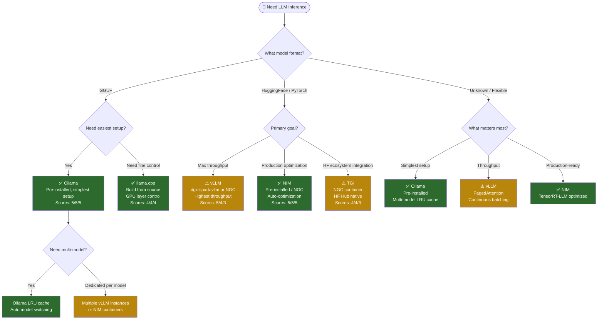
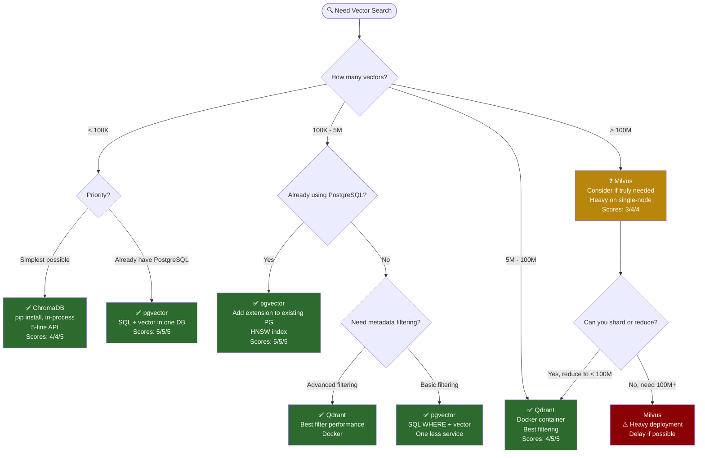
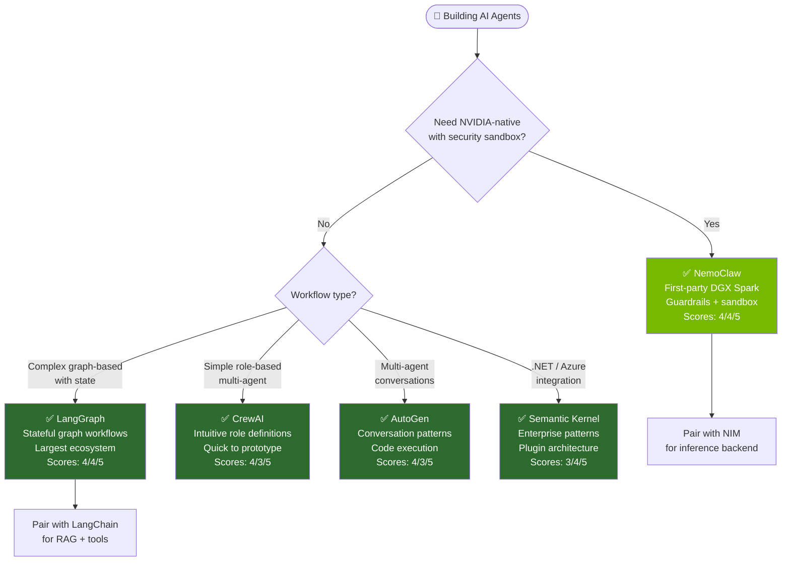
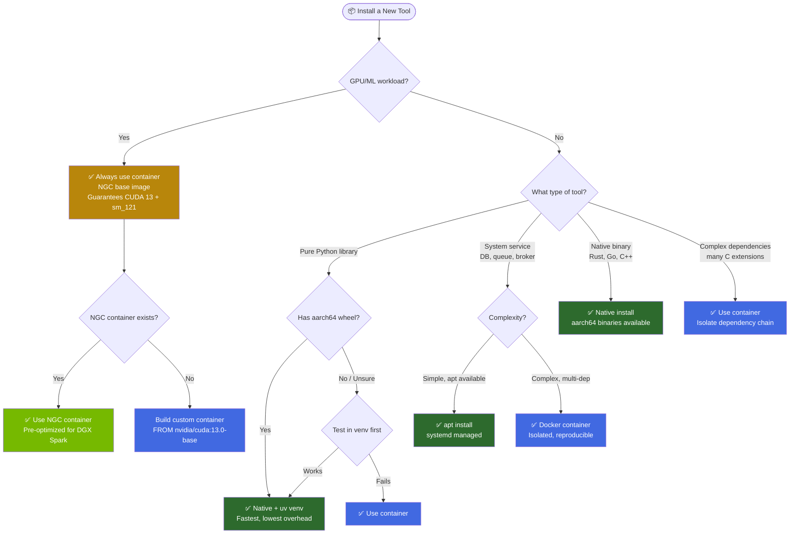
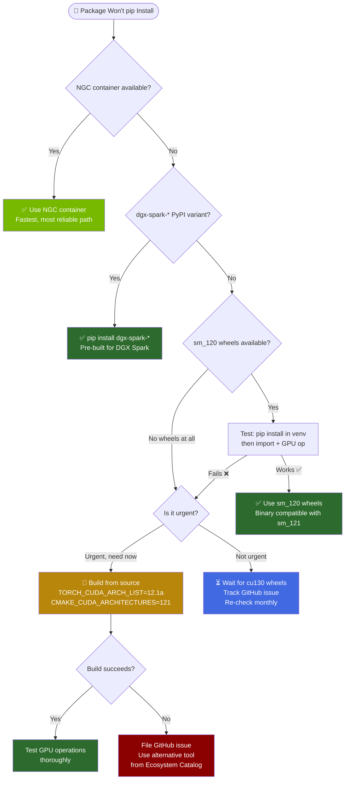
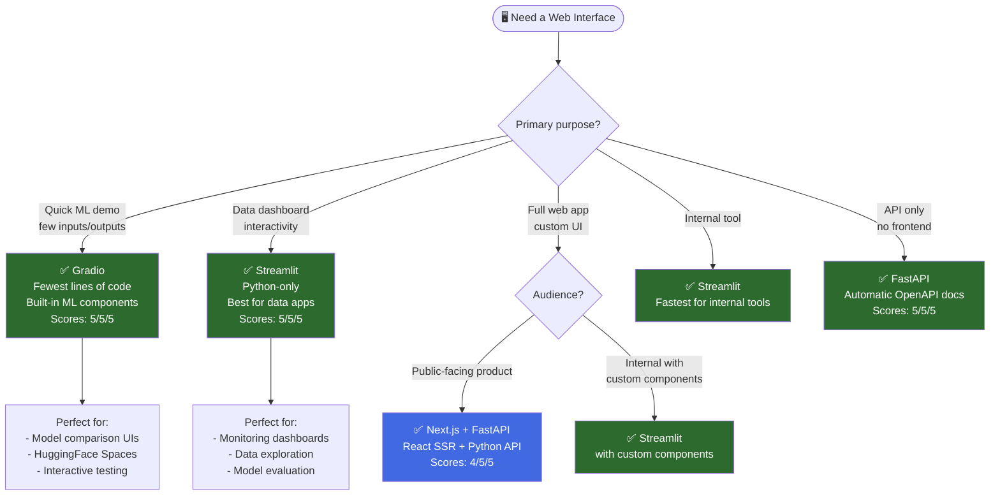
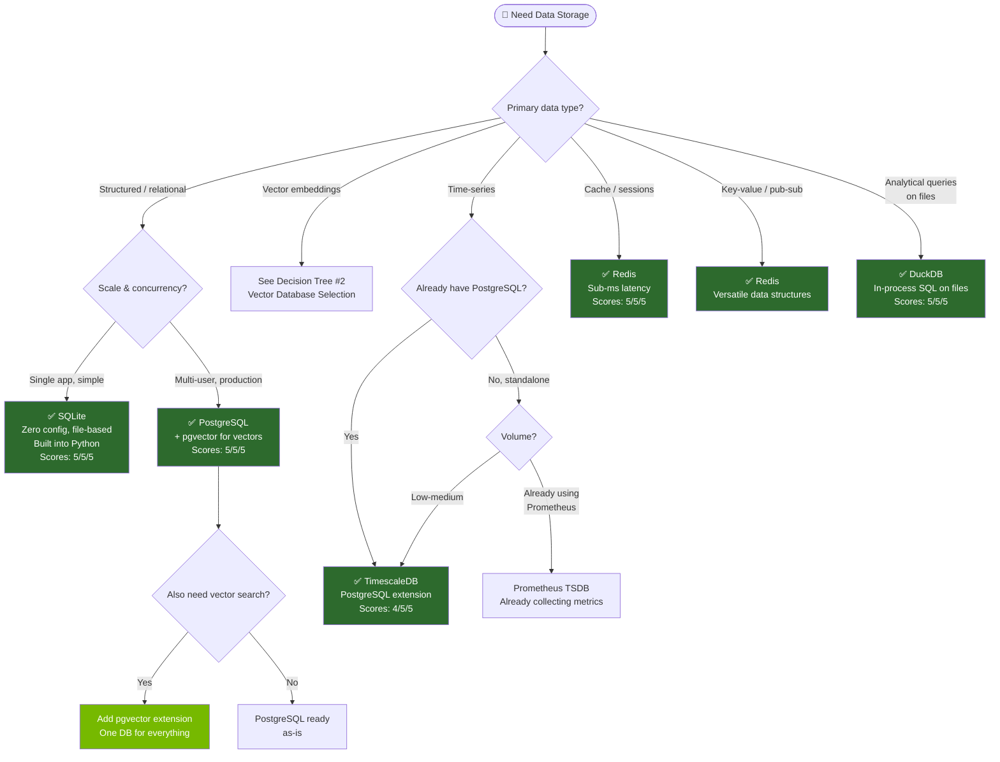
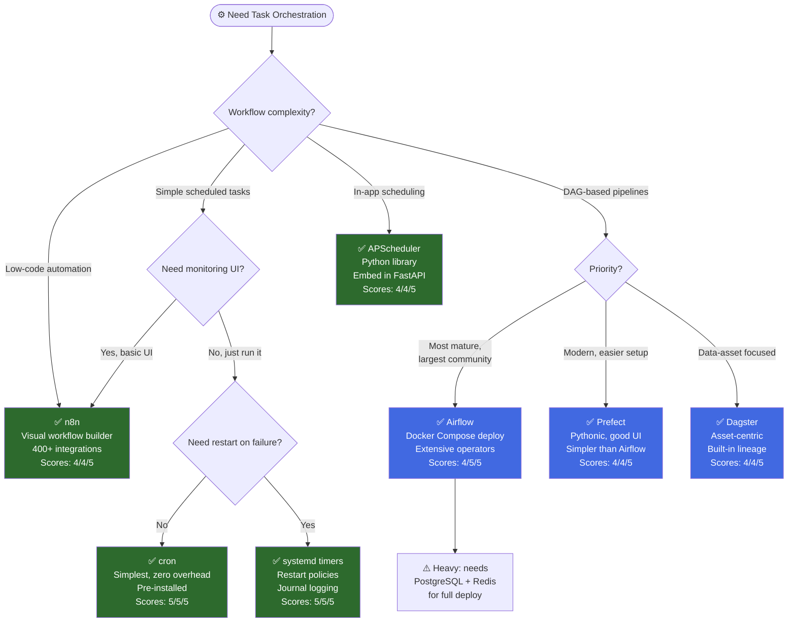

# Decision Trees for Tool Selection — DGX Spark Expert System

> **Last Updated**: 2026-03-31
> **Status**: Phase 2 — Complete
> **Platform**: NVIDIA DGX Spark (GB10 Grace Blackwell Superchip)
> **Baseline**: ARM64 (aarch64) · CUDA 13.0.2 · sm_121 · Ubuntu 24.04 · 128 GB Unified Memory
> **Maintainer**: DGX Spark Expert System

---

## Overview

These decision trees guide tool selection for common DGX Spark workflows. Each tree is a Mermaid flowchart that can be rendered in any Markdown viewer with Mermaid support (GitHub, VS Code, Obsidian, etc.).

### How to Use

1. Start at the top of the relevant decision tree
2. Follow the decision nodes based on your requirements
3. Arrive at a recommended tool
4. Cross-reference with the [Ecosystem Catalog](../docs/tooling/ecosystem-catalog.md) for detailed compatibility information

---

## Table of Contents

1. [Which Inference Engine?](#1-which-inference-engine)
2. [Which Vector Database?](#2-which-vector-database)
3. [Which Agent Framework?](#3-which-agent-framework)
4. [Container or Native?](#4-container-or-native)
5. [Build from Source or Wait?](#5-build-from-source-or-wait)
6. [Which Web UI Framework?](#6-which-web-ui-framework)
7. [Which Database?](#7-which-database)
8. [Which Orchestration Tool?](#8-which-orchestration-tool)

---

## 1. Which Inference Engine?

Choose the right inference engine based on model format, performance needs, and setup complexity.

**Quick Reference**:
| Need | Recommendation |
|------|---------------|
| Fastest to start | Ollama (pre-installed) |
| Highest throughput | vLLM (dgx-spark-vllm) |
| Production serving | NIM (TensorRT-LLM) |
| GGUF with control | llama.cpp (build from source) |
| Multi-model switching | Ollama (LRU cache) |
| HuggingFace native | TGI (NGC container) |

---

## 2. Which Vector Database?

Choose based on scale, existing infrastructure, and use case.

**Quick Reference**:
| Scale | Default Choice |
|-------|---------------|
| Prototyping / < 100K | ChromaDB |
| Have PostgreSQL / < 5M | pgvector |
| Production + filtering / < 100M | Qdrant |
| > 100M (rare on single-node) | Milvus (delay if possible) |

---

## 3. Which Agent Framework?

Choose based on features, ecosystem, and integration needs.

**Quick Reference**:
| Need | Framework |
|------|-----------|
| NVIDIA-native + security | NemoClaw |
| Graph-based workflows | LangGraph |
| Role-based multi-agent | CrewAI |
| Conversation orchestration | AutoGen |
| .NET / Enterprise | Semantic Kernel |

---

## 4. Container or Native?

Decide whether to run a tool in a Docker container or install natively.

**Rule of Thumb**:
| Tool Type | Install Method |
|-----------|---------------|
| GPU/ML workload | Container (NGC preferred) |
| Pure Python | Native + uv venv |
| System service (DB, cache) | apt install or Docker |
| Complex C/C++ dependencies | Container |
| Go/Rust binary | Native aarch64 binary |

---

## 5. Build from Source or Wait?

When a package doesn't have ready-made aarch64/cu130 wheels.

**Priority Order**:
1. NGC container (if available)
2. `dgx-spark-*` PyPI variant (if available)
3. sm_120 binary-compatible wheel (test first)
4. Build from source (`TORCH_CUDA_ARCH_LIST=12.1a`)
5. Wait for upstream cu130 wheel

---

## 6. Which Web UI Framework?

Choose based on purpose, audience, and development speed.

**Quick Reference**:
| Need | Framework | Lines to Demo |
|------|-----------|:---:|
| ML model demo | Gradio | ~5 |
| Data dashboard | Streamlit | ~20 |
| Internal tool | Streamlit | ~50 |
| Full web app | Next.js + FastAPI | ~200+ |
| API only | FastAPI | ~10 |

---

## 7. Which Database?

Choose based on data type, query patterns, and scale.

**Quick Reference**:
| Data Type | Default Choice |
|-----------|---------------|
| Relational (simple) | SQLite |
| Relational (production) | PostgreSQL |
| Vector embeddings | pgvector (with PG) or ChromaDB |
| Time-series | TimescaleDB (PG extension) |
| Cache / sessions | Redis |
| Analytical on files | DuckDB |

---

## 8. Which Orchestration Tool?

Choose based on workflow complexity, team size, and features needed.

**Quick Reference**:
| Need | Tool | Overhead |
|------|------|----------|
| Simple schedule | cron | Zero |
| Schedule + restart | systemd timers | Zero |
| In-app scheduling | APScheduler | None (library) |
| Visual low-code | n8n | Docker container |
| DAG pipelines (standard) | Airflow | Heavy (PG + Redis) |
| DAG pipelines (modern) | Prefect | Medium |
| Data asset pipelines | Dagster | Medium |

---

## Cross-Reference Matrix

For tools that appear in multiple decision trees:

| Tool | Appears In | Primary Role |
|------|-----------|-------------|
| Ollama | #1 Inference | Default LLM inference |
| PostgreSQL | #2 Vector, #7 Database | Relational + vector (with pgvector) |
| pgvector | #2 Vector, #7 Database | Vector search extension for PG |
| FastAPI | #6 Web UI | API framework |
| Docker/NGC | #4 Container | Container runtime |
| Redis | #7 Database, #8 Orchestration | Cache, queue, pub/sub |
| Streamlit | #6 Web UI | Data dashboards |
| NIM | #1 Inference | Production inference |

---

## Quality Template

### Summary

8 decision trees covering the most common tool selection decisions on DGX Spark: inference engine, vector database, agent framework, container vs. native, build strategy, web UI, database, and orchestration. Each tree provides clear paths based on real-world requirements.

### Practical Implications

- These trees encode the DGX Spark constraint knowledge (ARM64, CUDA 13, sm_121, container-first)
- Green nodes are safe choices; yellow nodes need caution; red nodes should be avoided
- Trees should be traversed top-down; each path leads to a single recommended tool
- Cross-reference the [Ecosystem Catalog](../docs/tooling/ecosystem-catalog.md) for full 14-field details

### Recommended Actions

1. Use these trees when starting any new project component
2. Print/bookmark the Quick Reference tables for rapid decisions
3. When a tool appears in the Avoid/Delay path, check the [Avoid / Delay List](../docs/tooling/avoid-delay-list.md)
4. Update trees when new tools are evaluated or compatibility changes

### Confidence Level

**HIGH** for tool recommendations (based on verified compatibility data). **MEDIUM** for specific score comparisons (may vary by use case and workload).

### Source Notes

Decision tree recommendations are derived from:
- NVIDIA DGX Spark official documentation
- Ecosystem Catalog compatibility assessments
- Community testing reports
- Architecture compatibility analysis

### Unresolved Questions

1. Should vLLM move to "Default" once dgx-spark-vllm stabilizes?
2. When Milvus Lite matures, does it change the vector DB decision tree?
3. Should JAX-based inference engines be added to Tree #1?
